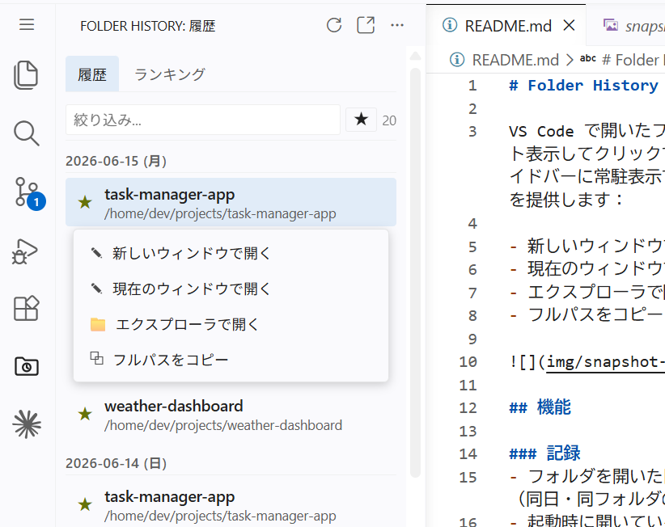

# Folder History

VS Code で開いたフォルダを日付付きで記録し、過去の履歴をリスト表示してクリックで開ける拡張機能です。アクティビティバーのサイドバーに常駐表示でき、各フォルダに対して以下の表示アクションを提供します：

- 新しいウィンドウで開く
- 現在のウィンドウで開く
- エクスプローラで開く
- フルパスをコピー



## 機能

### 記録
- フォルダを開いた日付を `YYYY-MM-DD`（ローカル日付）で記録（同日・同フォルダの重複は 1 件）
- 起動時に開いているフォルダと、起動後に追加されたフォルダ（`onDidChangeWorkspaceFolders`）を自動記録
- マルチルートワークスペース対応（フォルダごとに個別記録）
- ローカルの `file` スキームのフォルダのみ対象

### 表示
- アクティビティバーの **Folder History** ビュー（サイドバー）、または「Folder History: Show」で独立パネルに表示
- **履歴タブ**: 日付ごとにグループ化（例: `2026-04-27 (月)`）、新しい日付順。日付不明（`date: null`）のエントリは末尾の「日付不明」セクションに表示
- **ランキングタブ**: 月セレクタ（◀ ▶）で対象月を切替え、その月に開いた実日数が多い順にフォルダをランキング表示（`date: null` は集計対象外）
- フォルダ名・パスでのテキスト絞り込み
- 各行のアクション: 新しいウィンドウで開く／現在のウィンドウで開く（`vscode.openFolder`）／エクスプローラ・Finder で開く（`revealFileInOS`）／フルパスをコピー

### スター（お気に入り）
- 各行の ★/☆ アイコンでフォルダ単位のスターを切替え
- 絞り込み欄の横の ★ トグルでスター付きのみに絞り込み（テキスト絞り込みと AND 条件）

### データ管理
- ログ JSON を直接開いて編集可能（「Folder History: Open Log File」）
- 履歴とスターを JSON ファイルへ書き出し（「Folder History: Export」）、別ファイルから取り込み（「Folder History: Import」、重複はスキップ）
- VS Code の `state.vscdb` の `recentlyOpenedPathsList` を `date: null` で取り込み（「Folder History: Import from VS Code Recent List」、Windows のみ）

## コマンド

| コマンド                                          | 説明                                          |
| ------------------------------------------------- | --------------------------------------------- |
| `Folder History: Show`                            | 履歴一覧を WebView パネルで表示               |
| `Folder History: Refresh`                         | 表示を再読み込み                              |
| `Folder History: Open Log File`                   | `history.json` をエディタで開く               |
| `Folder History: Export`                          | 履歴・スターを JSON へ書き出し                |
| `Folder History: Import`                          | JSON から履歴・スターを取り込み               |
| `Folder History: Import from VS Code Recent List` | VS Code の最近使用した項目を取込み（Windows） |

## データ保存場所

```
%APPDATA%\Code\User\globalStorage\local.folder-history\history.json
```

実際は VS Code の `globalStorageUri` が解決するパスに保存されます（パブリッシャー名 `local`、拡張ID `folder-history`）。OS によりパスは異なります（macOS: `~/Library/Application Support/Code/...`、Linux: `~/.config/Code/...`）。

### フォーマット（v2）

```json
{
  "version": 2,
  "entries": [
    { "date": "2026-04-27", "path": "C:\\projects\\foo", "name": "foo" },
    { "date": null, "path": "C:\\old\\bar", "name": "bar" }
  ],
  "stars": ["C:\\projects\\foo"]
}
```

- 重複排除キー: `date + path`
- v1（`stars` なし）ファイルは読み込み時に `stars: []` を自動補完して後方互換

## ビルド

```bash
npm install
npm run compile
```

## パッケージ化

```bash
npx vsce package
code --install-extension folder-history-0.6.0.vsix
```

## 注意

- 表示系（開く／コピー）はクロスプラットフォーム対応（`revealFileInOS`・`vscode.openFolder`）
- 「Import from VS Code Recent List」は Windows パス（`%APPDATA%`）を前提
- VS Code バージョン: 1.80 以上
- 外部通信なし、ローカル完結
- 依存ライブラリは `vscode` API と Node.js 標準モジュール（`fs`, `path`）のみ
