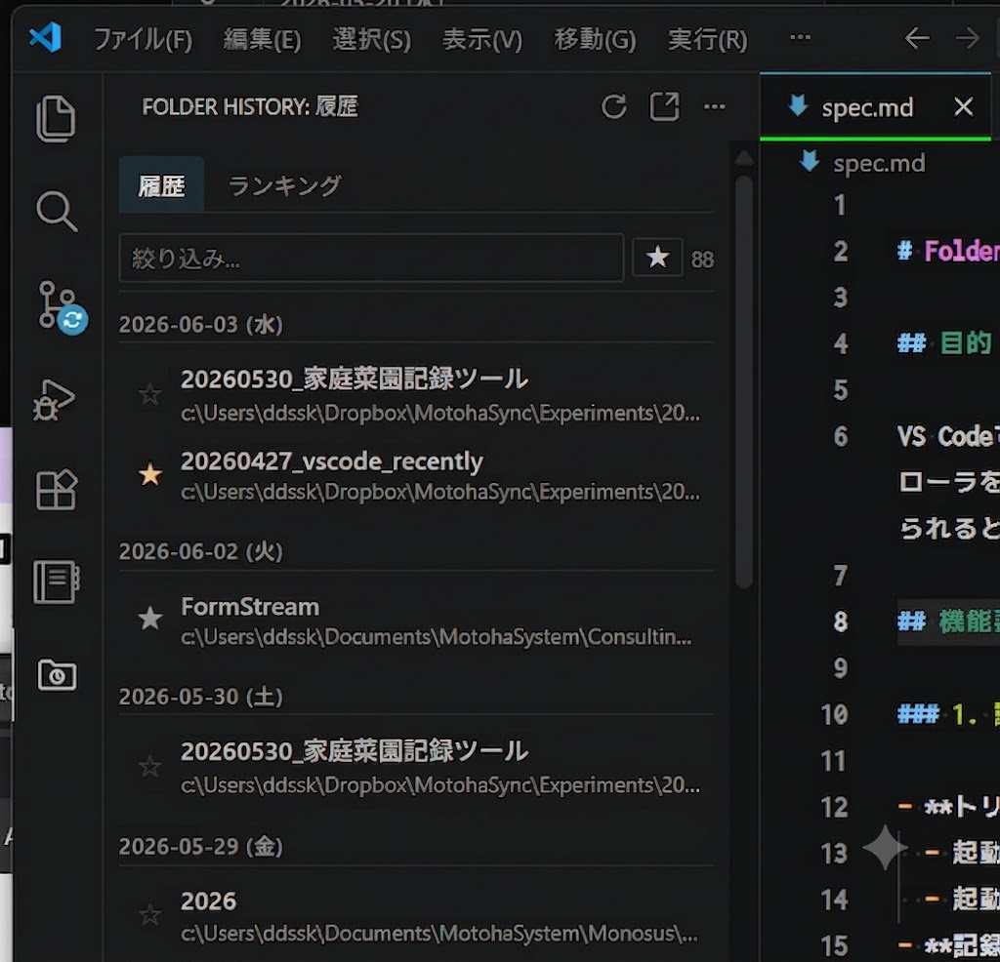

# Folder History

VS Code で開いたフォルダを日付付きで記録し、過去履歴をリスト表示してクリックでエクスプローラを開ける拡張機能です。



## 機能

- フォルダを開いた日付を `YYYY-MM-DD` で記録（同日重複は1件）
- マルチルートワークスペース対応（フォルダごとに記録）
- 「Folder History: Show」で日付ごとにグループ化されたリストを WebView で表示
- 行クリックで OS のエクスプローラ／Finder で開く（`revealFileInOS`）
- フォルダ名・パスでテキスト検索
- ログ JSON を直接開いて編集可能（「Folder History: Open Log File」）
- `state.vscdb` の `recentlyOpenedPathsList` を `date: null` で取り込み（「Folder History: Import from VS Code Recent List」）

## コマンド

| コマンド                                          | 説明                               |
| ------------------------------------------------- | ---------------------------------- |
| `Folder History: Show`                            | 履歴一覧を WebView で表示          |
| `Folder History: Open Log File`                   | `history.json` をエディタで開く    |
| `Folder History: Import from VS Code Recent List` | VS Code の最近使用した項目を取込み |

## データ保存場所

```
%APPDATA%\Code\User\globalStorage\local.folder-history\history.json
```

実際は VS Code の `globalStorageUri` が解決するパスに保存されます（パブリッシャー名 `local`、拡張ID `folder-history`）。

## ビルド

```bash
npm install
npm run compile
```

## パッケージ化

```bash
npx vsce package
code --install-extension folder-history-0.1.0.vsix
```

## 注意

- 対象 OS: Windows 優先（`Import from VS Code Recent List` は Windows パスを前提）
- VS Code バージョン: 1.80 以上
- 外部通信なし、ローカル完結
- 依存ライブラリは `vscode` API と Node.js 標準モジュール（`fs`, `path`）のみ
